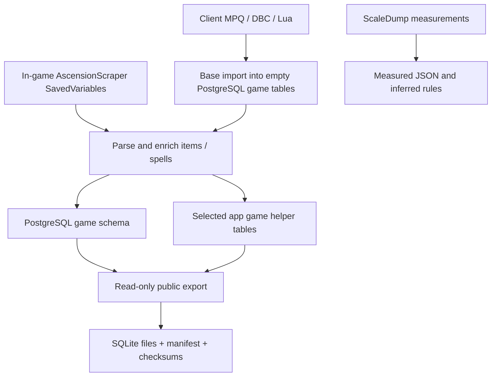

# Reproducing the pipeline



## 1. Explore the published snapshot first

Download all three release assets listed in the root README. Run
`python scripts/unpack-data.py`, then `npm run data:verify` after `npm ci`.
The release can be queried directly using SQLite. Export time is not the date
every item was observed; per-record capture dates are preserved where present.

## 2. Start a new PostgreSQL research database

Use an empty database for rebuilding from client files. Copy `.env.example` to
`.env`, fill in your own local credentials and client Data directory, then run:

```bash
npm ci
npm run game:schema
npm run game:import-ascension
npm run game:check
```

`game:schema` downloads the current AoWoW schema and converts supported MySQL
DDL into PostgreSQL. It can therefore change as upstream changes; the release
manifest/dictionary describes the actual published snapshot. This is not a
promise that a future upstream schema will recreate the snapshot byte for byte.

The original base importer calls `truncateTables` before inserting client data.
For this standalone repository that function has been replaced with an empty
table check: it rejects an already populated target. Create a new database for
another rebuild; don't erase a database containing tooltip/talent overlays.
The importer also creates helper columns/tables and widens certain client ID
columns. These are its historical import semantics, not a game migration plan.

The schema uses `game` for legacy game records and `app` for derived helpers.
No Prisma or Tavern user/account tables are required. Import history is best
effort and becomes a no-op if `app.import_jobs` does not exist.

## 3. Enrich the base rows in game

Install the included addons and follow [the capture guide](in-game-scraping.md).
Stage item tooltip files in `output/addon/tooltip/`, then run:

```bash
npm run game:split-scraper -- output/addon/tooltip output/addon/tooltip-split 5000
npm run game:import-scraper -- output/addon/tooltip-split
```

The splitter handles **items**. Preserve mixed/spell SavedVariables separately
and import a manageable complete file directly, for example:

```bash
npm run game:import-scraper -- output/addon/spells-mage.lua
```

The current default import input is `output/addon/tooltip-split`, not all of
`output/addon`. Direct inputs above 500,000,000 bytes are rejected. Recursive
directory import selects `.lua`; a single JSON payload can be supplied directly.
Never execute arbitrary Lua captures: the importer parses their data tables.

Default item/spell fields fill empty values and placeholders; set
`ASCENSION_SCRAPER_OVERWRITE=1` only for a deliberate overwrite. Set
`ASCENSION_SCRAPER_INSERT_MISSING=0` to disable missing-row insertion. These
options do not turn off helper-table refreshes. Each input file commits in its
own transaction, so a later failure can leave earlier files successfully imported.

`game:backup` and `--backup` use the original **whole database** `pg_dump`, which
may include private app records. They are local recovery tools, not public export
tools. Keep their output private. Public snapshots use `data:export` only.

## 4. Rebuild scaling and optional enrichments

```bash
npm run game:scaledump
```

Raw scaling captures and dense references are included. The processor merges
files by modification time, with path as a tie-breaker; later rows win conflicts.
The included three sparse files have zero conflicting rows. See
[scaling](../items/scaling.md) before interpreting generated rules.

For a new talent overlay, obtain a `CoaExporter.lua` catalog from your client,
then `npm run game:import-coa-talents -- output/CoaExporter.lua`. The source
CoaExporter addon and original builder JSON are not available in this repository;
their imported game rows are preserved in the snapshot.

For AtlasLoot, unpack the provided raw AtlasLoot archive or obtain a compatible addon. Set `DATABASE_URL` to the same
research database when using its importer; then run
`npm run atlasloot:import -- --addon=/path/to/AtlasLootAddon`. The included SQL under `reference/` explains
Tavern's other derived read models. Those migration excerpts are not a standalone
migration chain; some expect functions installed by earlier Tavern migrations.

## 5. Export and verify portable .db files

```bash
npm run data:export -- --out output/new-snapshot
npm run data:verify -- output/new-snapshot
```

The exporter opens one read-only repeatable-read PostgreSQL transaction for both
files, selects only `scripts/public-tables.json`, streams rows into SQLite, checks
counts against that same source snapshot, runs SQLite integrity checks, compresses
the databases, and emits SHA-256 checksums and a schema manifest. Existing outputs
are rejected. Failed output directories may contain partial artifacts; use a new
directory after investigating the failure. No credentials or connection URL is
written to the manifest.

Publish the two `.db.gz` files and matching manifest together as a GitHub release.
Keep large binaries out of Git history. Changing a source table during a later
capture requires a new snapshot/version; don't silently replace released data.
